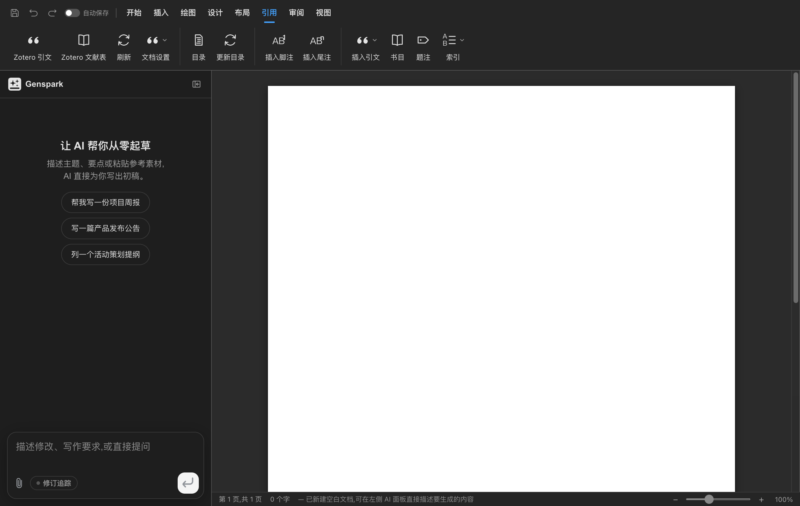
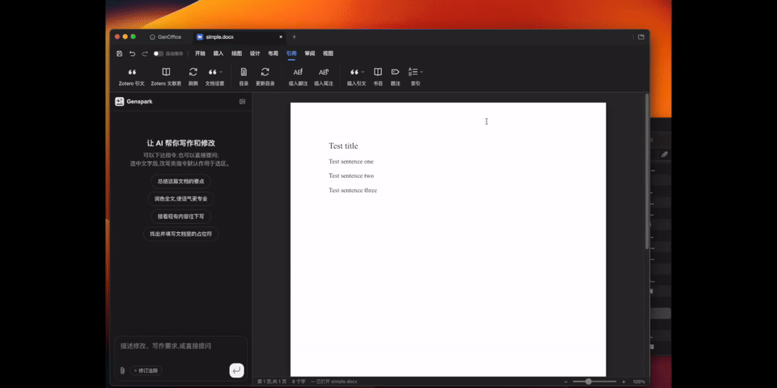

# GenOffice Zotero Integration

[Chinese](README.zh-CN.md)

> [!IMPORTANT]
> This is an unofficial derivative project based on GenOffice. It is not affiliated with or
> endorsed by GenOffice, Genspark, or Zotero. This alpha preview is intended for testing and
> evaluation and should not be used for important or production documents.

## Overview

GenOffice Zotero Integration is an unofficial derivative of
[GenOffice v0.9.10](https://github.com/genspark-ai/genoffice/tree/v0.9.10). Its goal is to make
Zotero available inside GenOffice Docs with a workflow similar to the Zotero integrations for
Microsoft Word and WPS Office.

The branch keeps the complete GenOffice application shell. Product changes are scoped to Zotero
integration in `apps/docs` and Zotero-compatible DOCX round trips in `packages/docx-engine`.



## Implemented

- Communication with Zotero Desktop through Zotero LibreOffice Integration API v3.
- Add, edit, and refresh in-text citations and bibliographies.
- Open Zotero document preferences or remove field codes while retaining visible text.
- Preserve Word `ADDIN ZOTERO_*` fields and `ZOTERO_PREF_1..n` custom properties.
- Preserve one logical Zotero bibliography field across multiple paragraphs.
- Split Zotero bibliography entries into separate paragraphs.
- Map common Zotero RTF formatting: bold, italic, underline, strike-through, superscript,
  subscript, font size, and capitalization.
- Map hanging indents, paragraph spacing, and alignment.
- Preserve the original GenOffice light, dark, and system themes.

## Download and installation

The current release is an unsigned test build produced on an Intel Mac:

1. Download `GenOffice-Zotero-Intel-macOS.zip` from
   [Releases](https://github.com/yiyuexiong/genoffice-zotero/releases).
2. Extract it and move `GenOffice.app` to Applications.
3. Start Zotero Desktop before starting GenOffice.
4. If macOS blocks the unsigned application, confirm it under System Settings > Privacy &
   Security.

Verified environment: Zotero 9.0.6, macOS Intel x86_64, and GenOffice v0.9.10.
Apple Silicon, Windows, and Linux users currently need to build from source (sorry, I do not
currently have an Apple Silicon Mac, a Windows PC, or a Linux computer).

## Usage

1. Start Zotero.
2. Open or create a `.docx` document in GenOffice.
3. Open the References tab.
4. Use Zotero Citation, Zotero Bibliography, Refresh, or Document Preferences.
5. Save as DOCX. Zotero field codes are stored together with their visible content.



GenOffice communicates with the local Zotero process through `127.0.0.1:23116`. It does not read
or modify the Zotero database directly.

## Build from source

Node.js 22.12 or newer and npm 10 or newer are required.

```bash
npm install
npm run dev
```

Build Docs and the complete GenOffice shell:

```bash
npm run build -w @genoffice/docs
npm run build -w @genoffice/shell
```

Run the core checks:

```bash
npm run test -w @genoffice/docs
npm run test -w @genoffice/docx-engine
npm run typecheck -w @genoffice/docs
npm run typecheck -w @genoffice/docx-engine
```

Current verified baseline: 1525 Docs tests passed; 1001 DOCX engine tests passed and 1 skipped.

## Known limitations

- Zotero footnote and endnote citations are not implemented.
- `Document_setBibliographyStyle` is not fully mapped; paragraph formatting included in RTF is
  supported.
- RTF font tables, colors, and complex embedded objects are not mapped.
- Zotero document migration, placeholder conversion, and export/import are not implemented.
- A manual Word, WPS, and GenOffice round-trip matrix has not been completed.
- The current macOS build is Intel x86_64 only, unsigned, and not notarized.

## Upstream, license, and trademarks

This project is based on [genspark-ai/genoffice](https://github.com/genspark-ai/genoffice). The
original README is preserved at [README-GENOFFICE.md](README-GENOFFICE.md). This repository retains
the upstream [Apache License 2.0](LICENSE), [NOTICE](NOTICE), and third-party notices. The `ee/`
directory is governed by its separate license.

The GenOffice and Genspark names and logos are trademarks of Mainfunc, Inc.; Apache-2.0 does not
grant trademark rights. Zotero is a trademark of the Corporation for Digital Scholarship. This
project is not affiliated with or endorsed by any of these organizations. Before publicly
distributing the derivative application, replace the original GenOffice name and icon and complete
independent code signing and notarization.

## Development status

The published branch is `main`, based on GenOffice v0.9.10 commit `f2c3d08`. The next priority is a
real Word, WPS, and GenOffice citation and bibliography round-trip matrix.
